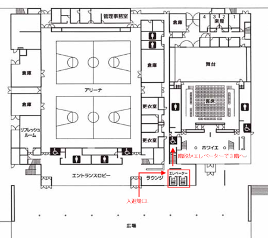
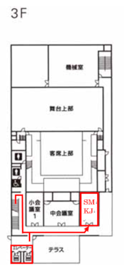

2月15日から2月16日に行われる[Tsukuba Mini Maker Faire][tmmf]に、
Self Made Keyboards in Japanが出展します。

[tmmf]: https://tmmf.jp/2020/

# 出展概要

自作キーボードコミュニティによる合同出展です．個々のキーボードの展示に加え，キーボードの自作についてより深く知っていただくための工夫を行いました．

## 会場案内図

会場: つくばカピオ（茨城県つくば市竹園1-10-1）

Self Made Keyboards in Japanのブースは3F 小会議室2です。

1Fからエレベータで3Fに上がり、右手側に進む。
もしくは、エレベータ付近の階段で3Fに登り、右手側一番奥の部屋です。

(クリックで拡大します)

# 出展一覧

<!-- アルファベット順がいいかな -->

|出展者|出品物|概要|
|:--|:--|:--|
|kymok|Sugi 6x|DCC制作でも不自由しない60%キーボードです．|
||キースイッチテスター|プリンタ付き|
|ikeji|DMOTE|3Dプリンタで作られた3D形状のキーボードです。|
|ikeji|Double|2つのトラックボールを搭載した分割キーボードです。|
